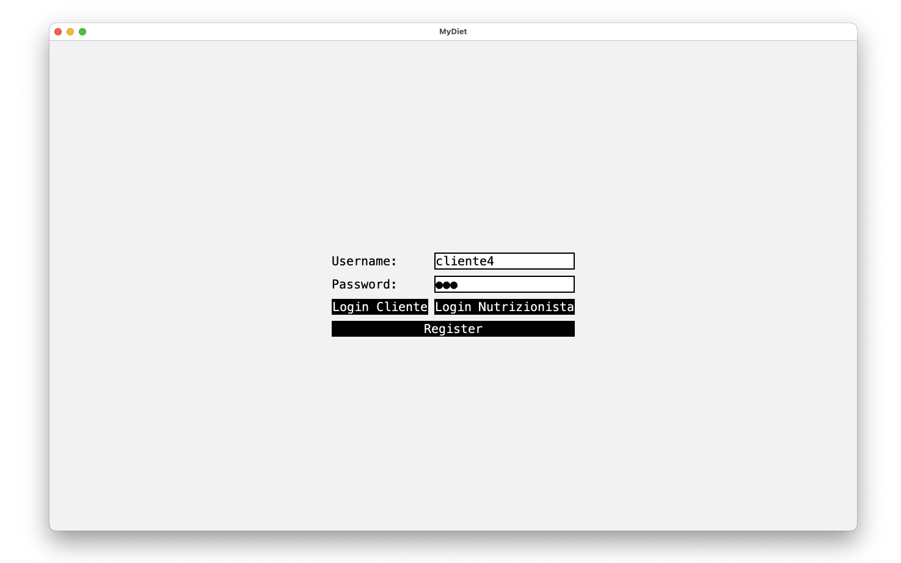

# MyDiet

**Database Project - University**  
Lucio Baiocchi, A.Y. 2023/2024

---

## Project Description

**MyDiet** is a system for managing personalized meal plans, connecting clients and nutritionists. It allows clients to track their diets and progress, while nutritionists can manage clients and update meal plans.

### Key Features:
- Weekly diet visualization.
- Client physical updates and progress tracking.
- Nutritionist reviews and ratings.
- Meal and diet modifications.
- Dietary supplement management.

---

## Project Structure

### Architecture
Built on **MVC (Model-View-Controller)**:
- **Model:** Manages data and MySQL communication.
- **View:** Swing-based graphical interface.
- **Controller:** Handles interactions between model and view.

### Technologies
- **Language:** Java 17
- **DBMS:** MySQL
- **Dependency Management:** Gradle
- **Versioning:** Git (GitHub)

---

## Main Functionalities

### For Clients:
1. View their diet.
2. Consult nutritionists.
3. Add physical updates.

### For Nutritionists:
1. Manage clients.
2. Modify meals and diets.
3. Track client progress.

### Additional Features:
- Add new foods and supplements.
- Display top-rated nutritionists.
- Statistics on client goal achievement.

---

## Design

### Conceptual Schema
- Entities: Client, Nutritionist, Diet, etc.
- Relationships: Diets consist of days and meals.
- Generalization: User as a base for Client and Nutritionist.

### Logical and Physical Schema
- Optimized queries for performance.
- Redundant attributes (e.g., average review score) for efficiency.

---

## Setup

### Requirements
1. **Java 17**
2. **MySQL 8.0+**
3. **Gradle 7.0+**

### Steps
1. Clone the repository.
2. Configure the database using the provided SQL script.
3. Update `config.properties` with database credentials.
4. Run the project with Gradle.

---

## Some demo photos

### CLient profile info

### Login

### Add new diet

### New prices

### Visualize diet

### Nutrizionist List

### Objective List

